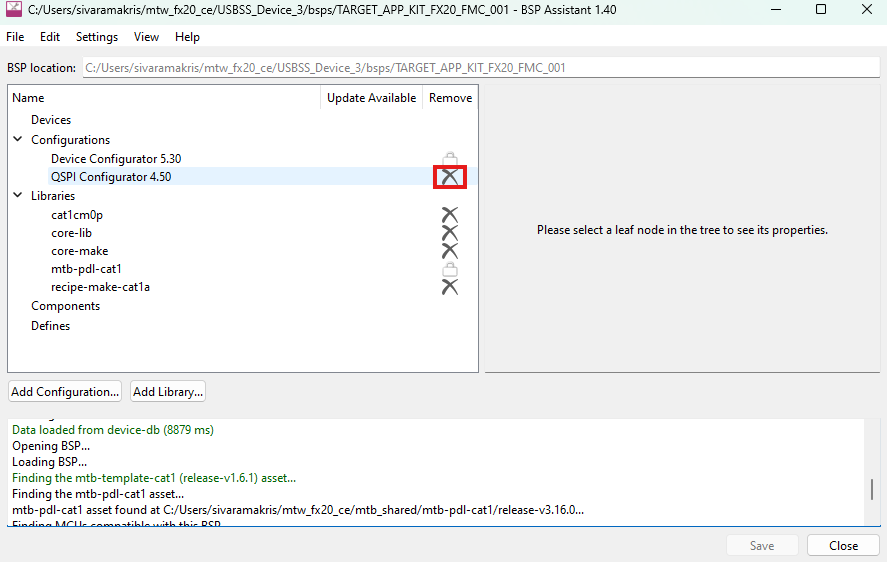
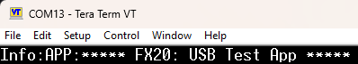
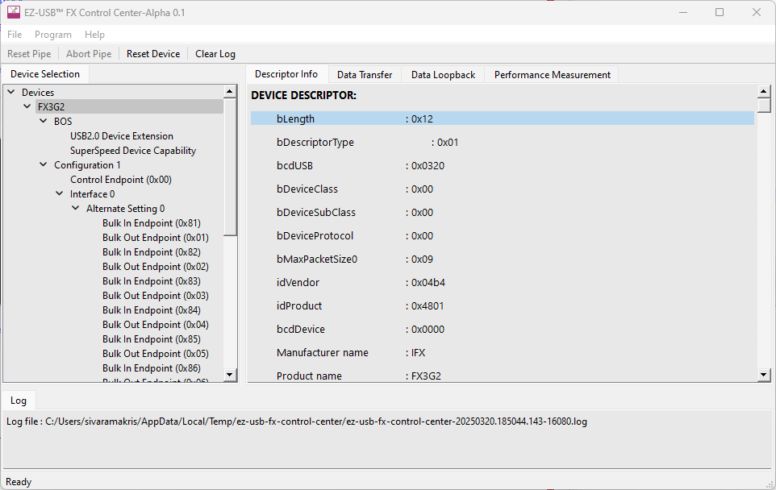
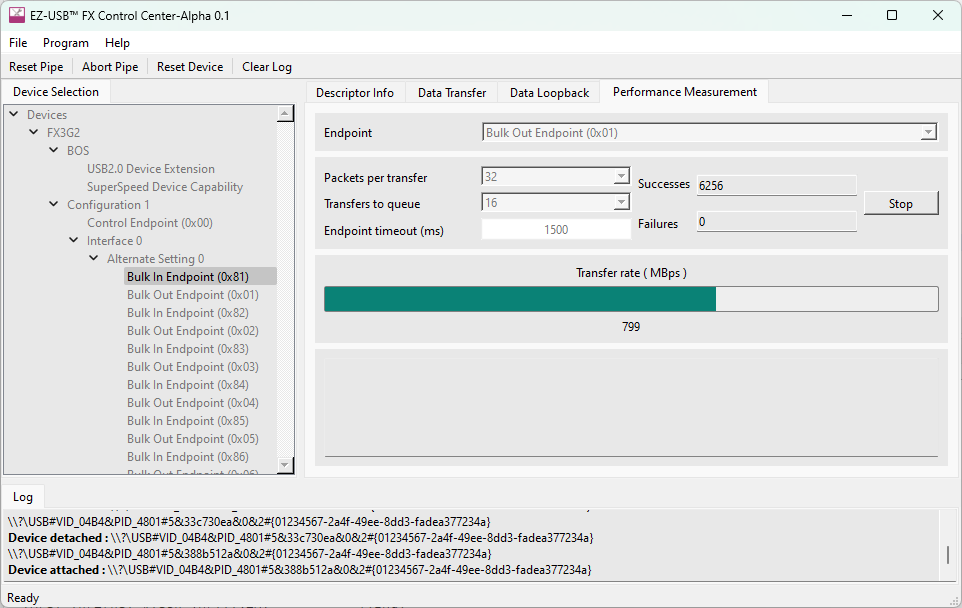
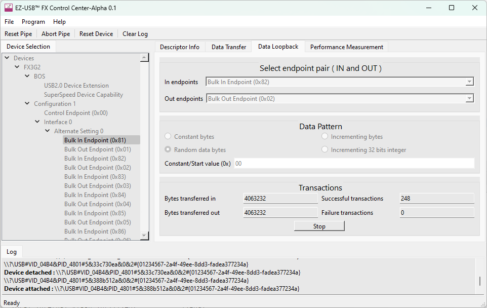

# EZ-USB&trade; FX20: USB test application

This code example implements a vendor-specific USB device that enables testing of various data transfer modes on Infineon's EZ-USB&trade; FX20 device. The application supports continuous streaming data for throughput measurement, loopback functionality for data integrity testing, and vendor-specific class requests that demonstrate control endpoint data transfers.

> **Note:** This code example is also applicable to EZ-USB&trade; FX10, EZ-USB&trade; FX5N, and EZ-USB&trade; FX5 devices.

[View this README on GitHub.](https://github.com/Infineon/mtb-example-fx20-usb-testapp)

[Provide feedback on this code example.](https://cypress.co1.qualtrics.com/jfe/form/SV_1NTns53sK2yiljn?Q_EED=eyJVbmlxdWUgRG9jIElkIjoiQ0UyNDEzNjIiLCJTcGVjIE51bWJlciI6IjAwMi00MTM2MiIsIkRvYyBUaXRsZSI6IkVaLVVTQiZ0cmFkZTsgRlgyMDogVVNCIHRlc3QgYXBwbGljYXRpb24iLCJyaWQiOiJzdWt1IiwiRG9jIHZlcnNpb24iOiIxLjAuMSIsIkRvYyBMYW5ndWFnZSI6IkVuZ2xpc2giLCJEb2MgRGl2aXNpb24iOiJNQ0QiLCJEb2MgQlUiOiJXSVJFRCIsIkRvYyBGYW1pbHkiOiJTU19VU0IifQ==)


## Requirements

- [ModusToolbox&trade;](https://www.infineon.com/modustoolbox) v3.5 or later (tested with v3.5)
- Board support package (BSP) minimum required version: 4.3.3
- Programming language: C


## Supported toolchains (make variable 'TOOLCHAIN')

- GNU Arm&reg; Embedded Compiler v11.3.1 (`GCC_ARM`) – Default value of `TOOLCHAIN`
- Arm&reg; Compiler v6.22 (`ARM`)


## Supported kits (make variable 'TARGET')

- [EZ-USB&trade; FX20 DVK](https://www.infineon.com/fx20) (`KIT_FX20_FMC_001`) – Default value of `TARGET`


## Hardware setup

This example uses the board's default configuration. See the kit user guide to ensure that the board is configured correctly.


## Software setup

See the [ModusToolbox&trade; tools package installation guide](https://www.infineon.com/ModusToolboxInstallguide) for information about installing and configuring the tools package.

Install a terminal emulator if you do not have one. Instructions in this document use [Tera Term](https://teratermproject.github.io/index-en.html).

Install the [EZ-USB&trade; FX Control Center](https://softwaretools.infineon.com/tools/com.ifx.tb.tool.ezusbfxcontrolcenter) application for assistance with device programming and testing.


## Using the code example


### Create the project

The ModusToolbox&trade; tools package provides the Project Creator as both a GUI tool and a command line tool.

<details><summary><b>Use Project Creator GUI</b></summary>

1. Open the Project Creator GUI tool

   There are several ways to do this, including launching it from the dashboard or from inside the Eclipse IDE. For more details, see the [Project Creator user guide](https://www.infineon.com/ModusToolboxProjectCreator) (locally available at *{ModusToolbox&trade; install directory}/tools_{version}/project-creator/docs/project-creator.pdf*)

2. On the **Choose Board Support Package (BSP)** page, select a kit supported by this code example. See [Supported kits](#supported-kits-make-variable-target)

   > **Note:** To use this code example for a kit not listed here, you may need to update the source files. If the kit does not have the required resources, the application may not work

3. On the **Select Application** page:

   a. Select the **Applications(s) Root Path** and the **Target IDE**

      > **Note:** Depending on how you open the Project Creator tool, these fields may be pre-selected for you

   b. Select this code example from the list by enabling its check box

      > **Note:** You can narrow the list of displayed examples by typing in the filter box

   c. (Optional) Change the suggested **New Application Name** and **New BSP Name**

   d. Click **Create** to complete the application creation process

</details>


<details><summary><b>Use Project Creator CLI</b></summary>

The 'project-creator-cli' tool can be used to create applications from a CLI terminal or from within batch files or shell scripts. This tool is available in the *{ModusToolbox&trade; install directory}/tools_{version}/project-creator/* directory.

Use a CLI terminal to invoke the 'project-creator-cli' tool. On Windows, use the command-line 'modus-shell' program provided in the ModusToolbox&trade; installation instead of a standard Windows command-line application. This shell provides access to all ModusToolbox&trade; tools. You can access it by typing "modus-shell" in the search box in the Windows menu. In Linux and macOS, you can use any terminal application.

The following example clones the "[mtb-example-fx20-usb-testapp](https://github.com/Infineon/mtb-example-fx20-usb-testapp)" example with the desired name "USB_Test_App" configured for the *KIT_FX20_FMC_001* BSP into the specified working directory, *C:/mtb_projects*:

   ```
   project-creator-cli --board-id KIT_FX20_FMC_001 --app-id mtb-example-fx20-usb-testapp --user-app-name USB_Test_App --target-dir "C:/mtb_projects"
   ```

The 'project-creator-cli' tool has the following arguments:

Argument | Description | Required/optional
---------|-------------|-----------
`--board-id` | Defined in the <id> field of the [BSP](https://github.com/Infineon?q=bsp-manifest&type=&language=&sort=) manifest | Required
`--app-id`   | Defined in the <id> field of the [CE](https://github.com/Infineon?q=ce-manifest&type=&language=&sort=) manifest | Required
`--target-dir`| Specify the directory in which the application is to be created if you prefer not to use the default current working directory | Optional
`--user-app-name`| Specify the name of the application if you prefer to have a name other than the example's default name | Optional

<br>

> **Note:** The project-creator-cli tool uses the `git clone` and `make getlibs` commands to fetch the repository and import the required libraries. For details, see the "Project creator tools" section of the [ModusToolbox&trade; tools package user guide](https://www.infineon.com/ModusToolboxUserGuide) (locally available at {ModusToolbox&trade; install directory}/docs_{version}/mtb_user_guide.pdf).

</details>


### Open the project

After the project has been created, you can open it in your preferred development environment.


<details><summary><b>Eclipse IDE</b></summary>

If you opened the Project Creator tool from the included Eclipse IDE, the project will open in Eclipse automatically.

For more details, see the [Eclipse IDE for ModusToolbox&trade; user guide](https://www.infineon.com/MTBEclipseIDEUserGuide) (locally available at *{ModusToolbox&trade; install directory}/docs_{version}/mt_ide_user_guide.pdf*).

</details>


<details><summary><b>Visual Studio (VS) Code</b></summary>

Launch VS Code manually, and then open the generated *{project-name}.code-workspace* file located in the project directory.

For more details, see the [Visual Studio Code for ModusToolbox&trade; user guide](https://www.infineon.com/MTBVSCodeUserGuide) (locally available at *{ModusToolbox&trade; install directory}/docs_{version}/mt_vscode_user_guide.pdf*).

</details>


<details><summary><b>Command line</b></summary>

If you prefer to use the CLI, open the appropriate terminal, and navigate to the project directory. On Windows, use the command-line 'modus-shell' program; on Linux and macOS, you can use any terminal application. From there, you can run various `make` commands.

For more details, see the [ModusToolbox&trade; tools package user guide](https://www.infineon.com/ModusToolboxUserGuide) (locally available at *{ModusToolbox&trade; install directory}/docs_{version}/mtb_user_guide.pdf*).

</details>


### Using this code example with specific manufacturer part numbers (MPNs)

By default, the code example build is targeted for the CYUSB4024-BZXI MPN, which has 512 KB of flash memory and 1024 KB of buffer RAM. Use the **BSP Assistant** tool to modify the application to target different EZ-USB&trade; FX20, EZ-USB&trade; FX10, EZ-USB&trade; FX5N, or EZ-USB&trade; FX5 family MPNs as shown in **Table 1**.

> **Note:** As this application requires more than 900 KB of DMA buffer RAM to support data transfers on all the endpoints, it is only supported on EZ-USB&trade; FX MPNs, which provide 1024 KB of Buffer RAM.

**Table 1. MPNs supported by this code example**

Part Number       | Family | Flash size (KB) | Buffer RAM size (KB) | SMIF support
:---------------- | :----- | :-------------- | :------------------- | :----------------
CYUSB4024-BZXI    | FX20   | 512             | 1024                 | Yes
CYUSB4022-FCAXI   | FX20   | 512             | 1024                 | No
CYUSB4021-FCAXI   | FX20   | 512             | 1024                 | Yes
CYUSB4014-FCAXI   | FX10   | 512             | 1024                 | Yes
CYUSB4013-FCAXI   | FX10   | 512             | 1024                 | Yes
CYUSB4011-FCAXI   | FX10   | 512             | 1024                 | Yes
CYUSB3284-FCAXI   | FX5N   | 512             | 1024                 | Yes
CYUSB3084-FCAXI   | FX5    | 512             | 1024                 | Yes
CYUSB3083-FCAXI   | FX5    | 512             | 1024                 | Yes


#### Setup for a different MPN

Perform the following steps to modify the code example to work on a different MPN, as listed in **Table 1**:

1. Launch the BSP Assistant tool:

   a. **Eclipse IDE:** Launch the BSP Assistant tool by navigating to **Quick Panel** > **Tools**

   b. **Visual Studio Code:** Select the ModusToolbox&trade; extension from the left menu bar and launch the BSP Assistant tool, which is available in the **Application** menu of the **MODUSTOOLBOX TOOLS** section

2. In **BSP Assistant**, select **Devices** from the tree view on the left

3. Choose the desired part from the dropdown menu on the right

4. Some of the EZ-USB&trade; MPNs do not support the serial memory interface (SMIF) block as shown in **Table 1**. The default BSP design has the QSPI interface to connect to the serial memories enabled – even though this application does not utilize the interface. If the target part does not support the SMIF block, follow these steps to remove it:

   a. Delete the QSPI configuration from the design as shown in **Figure 1**

   b. As prompted by the BSP assistant, manually delete the files for SMIF initialization generated by **Device Configurator**. Delete *cycfg_qspi_memslot.c* and *cycfg_qspi_memslot.h* files located at the *bsps/TARGET_APP_KIT_FX20_FMC_001/config/GeneratedSource* folder

5. Click "Save" to close the BSP Assistant tool

6. Build the application and proceed with programming

  **Figure 1. Disabling QSPI configuration using BSP Assistant**

  


## Operation

1. Connect the board (J2) to your PC using the provided USB cable

2. Connect the USB FS port (J3) on the board to the PC for debug logs

3. Open a terminal program and select the serial COM port. Set the serial port parameters to 8N1 and 921600 baud

4. Perform the following steps to program the board using the EZ-USB&trade; FX Control Center (Alpha) application

   1. To enter Bootloader mode:

         a. Press and hold the PMODE (SW2) switch

         b. Press and release the RESET (SW3) switch

         c. Release the PMODE switch

   2. Open the EZ-USB&trade; FX Control Center application. Observe the EZ-USB&trade; FX20 device displayed as **EZ-USB&trade; FX Bootloader**

   3. Select the **EZ-USB&trade; FX Bootloader** device in EZ-USB&trade; FX Control Center

   4. Click **Program** > **Internal Flash**

   5. Navigate to the *\<CE Title>/build/APP_KIT_FX20_FMC_001/Release* folder within the CE directory and locate the *.hex* file and program. Confirm if the programming is successful in the log window of the EZ-USB&trade; FX Control Center application

5. After programming, the application starts automatically. Confirm that the following title is displayed on the UART terminal

   **Figure 2. Terminal output on program startup**

   

6. The EZ-USB&trade; FX20 device connects as a vendor-specific USB device, which binds with the WinUSB driver on Windows machines. The device can be accessed on the EZ-USB&trade; FX Control Center utility as shown in **Figure 3**

   **Figure 3. Device view in EZ-USB&trade; Control Center**

   

7. When the default build settings are used, endpoint 1 in either direction is configured as a bulk endpoint supporting continuous data transfers and can be used for throughput testing. 

   In the Control Center application, use **Performance Measurement** to select the endpoint and transfer parameters, and click on **Start** to perform the test

   **Figure 4. Data throughput test using EZ-USB&trade; Control Center**

   

8. All the other endpoints (2 to 15) are configured in a loopback configuration. The device sends the data received on the Out endpoint back through the In endpoint. A data integrity test can be performed using the **Data Loopback** feature of EZ-USB&trade; Control Center. 

      Select the **Data Loopback** tab, choose the Out and In endpoints, ensuring the same indices are used for both. Select the data pattern and click on **Start** to perform the test

   **Figure 5. Data loopback test using EZ-USB&trade; Control Center**

   


## Debugging


### Using the Arm&reg; debug port

If you have access to a MiniProg or KitProg3 device, you can debug the example to step through the code.


<details><summary><b>In Eclipse IDE</b></summary>

Use the **\<Application Name> Debug (KitProg3_MiniProg4)** configuration in the **Quick Panel**. For details, see the "Program and debug" section in the [Eclipse IDE for ModusToolbox&trade; user guide](https://www.infineon.com/MTBEclipseIDEUserGuide).

</details>


<details><summary><b>In other IDEs</b></summary>

Follow the instructions in your preferred IDE.
</details>


### Log messages

The code example and the EZ-USB&trade; FX20 stack output debug log messages indicate any unexpected conditions and highlight the performed operations.

By default, the USB FS port is enabled for debug logs. To enable debug logs on UART, set the `USBFS_LOGS_ENABLE` compiler flag to '0u' in the *Makefile* file. SCB1 of the EZ-USB&trade; FX20 device is used as UART with a baud rate of 921600 to send out log messages through the P8.1 pin.

The verbosity of the debug log output can be modified by setting the `DEBUG_LEVEL` macro in the *main.c* file with the values shown in **Table 2**.

**Table 2. Debug values**

Macro value | Description
:--------   | :------------
1u          | Enable only error messages
2u          | Enable error and warning messages
3u          | Enable error, warning, and info messages
4u          | Enable all message types


## Design and implementation

This code example demonstrates the USB capabilities of Infineon's EZ-USB&trade; FX20 device. The application supports device operation in all USB modes of operation, from 20 Gbps (Gen 2x2) to 12 Mbps (Full-Speed), and the testing of data transfers in various configurations.

The application supports a default configuration where one endpoint in each direction is configured for continuous data transfers and all other endpoints are configured for the loopback operation. The application also supports an I2C-based control interface which lets you control the device operations.

The following interfaces are used in the application:

- **USB interface (J2 connector):** Used for the device enumeration and data transfers
- **USB FS interface (J3 connector):** Used for output of debug log messages
- **SCB0 (P10.0 and P10.1 pins):** Used as I2C interfaces through which commands are received for device control
- **SCB1 UART TX (P8.1 pin):** Used as an alternate interface for debug log messages
- **GPIO pins (P11.0, P11.1, P9.2, and P9.3):** Used to indicate the status of USB connection and data transfer


### I2C-based control interface

The application implements an I2C slave with a 0x08 address using SCB0. The SCL pin is P10.0 and the SDA pin is P10.1. I2C data rates of up to 1 MHz are supported.

The application expects to receive commands from the I2C master in the form of ASCII command strings and sends responses to indicate whether the commands succeeded or not.


#### I2C supported commands 

- `EPSL:` Used by the I2C master to select a pair of endpoints which should be paired to form a data loopback structure. The I2C master writes 20 bytes of data to the I2C interface in this format:

   ```
   0x45 0x50 0x53 0x4C <OUT EP> <IN EP> <EP TYPE> <BUFFER COUNT> <BUFSIZE_LSB> <BUFSIZE_MSB> <HSPKTSIZE_LSB> <HSPKTSIZE_MSB> <FSPKTSIZE_LSB> <FSPKTSIZE_MSB> <POLL_RATE> <RESERVED> <SSPKTSIZE_LSB> <SSPKTSIZE_MSB> <MAXBURST> <SS_BMATTRIB>
   ```

   Here, the Out and In endpoint numbers should be in the 1-15 range and specified in the numeric format. A maximum of 15 loopback pairs (30 endpoints) can be enabled at a time using `EPSL`. This command cannot be used while the USB connection is in the enabled state

   For example, to select EP 3-Out and EP 3-In as a loopback pair of bulk endpoints with a maximum burst size of 4 packets and using two DMA buffers of 8 KB each, the data written should be: 
   
   `0x45 0x50 0x53 0x4C 0x03 0x03 0x02 0x02 0x00 0x20 0x00 0x02 0x40 0x00 0x00 0x00 0x00 0x04 0x04 0x00`

- `SSEP:` Used by the I2C master to select a pair of Out and In endpoints to be configured as infinite data sink and source respectively. The I2C master writes 20 bytes of data to the I2C interface in this format:

   ```
   0x53 0x53 0x45 0x50 <OUT EP> <IN EP> <EP TYPE> <BUFFER COUNT> <BUFSIZE_LSB> <BUFSIZE_MSB> <HSPKTSIZE_LSB> <HSPKTSIZE_MSB> <FSPKTSIZE_LSB> <FSPKTSIZE_MSB> <POLL_RATE> <RESERVED> <SSPKTSIZE_LSB> <SSPKTSIZE_MSB> <MAXBURST> <SS_BMATTRIB>
   ```

   Here, the Out and In endpoint numbers should be in the 1-15 range and specified in the numeric format. This command cannot be used while the USB connection is in the enabled state.

   For example, to select EP 2-Out and EP 2-In as bulk endpoints operating as data source and sink with two buffers of 4 KB each, the data written should be: `0x53 0x53 0x45 0x50 0x02 0x02 0x02 0x02 0x00 0x10 0x00 0x02 0x40 0x00 0x00 0x00 0x00 0x04 0x04 0x00`

- `CONN:` Used by the I2C master to enable USB data connection. Use this command by writing the 4-byte sequence: `0x43 0x4F 0x4E 0x4E` (`CONN`) to the I2C device. The `CONN` command can only be used after at least one loopback pair has been enabled using the `EPSL` command

- `DISC:` Used by the I2C master to disable USB data connection. Any changes to the set of endpoints supported can be made only in the USB disconnected state. Send this command by writing the 4-byte sequence: `0x44 0x49 0x53 0x43` (`DISC`) to the I2C slave

- `CLRP:` Used to disable all previously added loopback endpoint pairs; use it by writing the 4-byte sequence: `0x43 0x4C 0x52 0x50` (`CLRP`). New pairs can be added there after using the EPSL command. Same as `EPSL`, `CLRP` can only be used while the USB connection is in the disabled state

- `CYDR:` Used to make the device enumerate with a VID/PID pair of `0x04B4/0x00F1`, which binds with the *CyUSB3.sys* driver. This command can only be used while the USB connection is not enabled and is issued by writing the 4-byte sequence: `0x43 0x59 0x44 0x52` (`CYDR`)

- `MSDR:` Used to make the device enumerate with a VID/PID pair of `0x04B4/0x4801` and with support for the Microsoft OS descriptors so the device can bind to the *WinUSB.sys* driver. This command can only be used while the USB connection is not enabled and is issued by writing the 4-byte sequence: `0x4D 0x53 0x44 0x52` (`MSDR`)

**Table 3. Summary of I2C commands**

Command bytes | EPSL | SSEP | CONN | DISC | CLRP | CYDR | MSDR
:--------     | :----| :--- | :----| :--- | :--- | :--- | :---
Byte 0 | 0x45 | 0x53 | 0x43 | 0x44 | 0x43 | 0x43 | 0x4D
Byte 1 | 0x50 | 0x53 | 0x4F | 0x49 | 0x4C | 0x59 | 0x53
Byte 2 | 0x53 | 0x45 | 0x4E | 0x53 | 0x52 | 0x44 | 0x44
Byte 3 | 0x4C | 0x50 | 0x4E | 0x43 | 0x50 | 0x52 | 0x52
Byte 4 | Out endpoint index | Out endpoint index | – | – | – | – | –
Byte 5 | In endpoint index | In endpoint index | – | – | – | – | –
Byte 6 | Endpoint type | Endpoint type | – | – | – | – | –
Byte 7 | DMA buffer count | DMA buffer count | – | – | – | – | –
Bytes [9:8] | DMA buffer size | DMA buffer size | – | – | – | – | –
Bytes [11:10] | Max packet size for USB HS | Max packet size for USB HS | – | – | – | – | –
Bytes [13:12] | Max packet size for USB FS | Max packet size for USB FS | – | – | – | – | –
Byte 14 | Endpoint polling rate | Endpoint polling rate | – | – | – | – | –
Byte 15 | 0x00 | 0x00 | – | – | – | – | –
Bytes [17:16] | Max packet size for USB SS | Max packet size for USB SS | – | – | – | – | –
Byte 18 | Packets per burst | Packets per burst | – | – | – | – | –
Byte 19 | bmAttributes value | bmAttributes value | – | – | – | – | –

<br>


#### I2C command response

After each command is received by the device, the application sends back a 4-byte response, which can be read from the device by the I2C master.

- An **ACK** response (0x41 0x43 0x4B 0x00) is sent if the command is successful
- An **ERR** response (0x45 0x52 0x52 0x00) is sent if the command is unsuccessful


#### Limitations of command processing

There are no exhaustive checks on the various command parameters passed in such as endpoint type, number, and size of buffers. The application may end up in a hard fault condition, hang, or send corrupted data in case invalid command parameters are passed in.


### Default endpoint configuration

The application supports enumerating with a default endpoint configuration for easy testing in cases where an I2C master is not available for control. This default configuration has the following endpoints enabled:

**Table 4. Endpoint properties**

Endpoint index | Type | Max packet size | Burst size | Interval | Bursts per interval | Buffer size | Transfer mode
:--------     | :----| :--- | :----| :--- | :--- | :--- | :---
1 | Bulk | 1024 | 16 | NA | NA | 48 KB | Source + Sink
2 | Interrupt | 1024 | 1 | 1 | 1 | 1 KB | Loopback
3 | Isochronous | 1024 | 8 | 1 | 1 | 64 KB | Loopback
4 | Bulk | 1024 | 16 | NA | NA | 16 KB | Loopback
5 | Bulk | 1024 | 16 | NA | NA | 16 KB | Loopback
6 | Bulk | 1024 | 16 | NA | NA | 16 KB | Loopback
7 | Bulk | 1024 | 16 | NA | NA | 16 KB | Loopback
8 | Bulk | 1024 | 16 | NA | NA | 16 KB | Loopback
9 | Bulk | 1024 | 16 | NA | NA | 16 KB | Loopback
10 | Bulk | 1024 | 16 | NA | NA | 16 KB | Loopback
11 | Bulk | 1024 | 16 | NA | NA | 16 KB | Loopback
12 | Bulk | 1024 | 16 | NA | NA | 16 KB | Loopback
13 | Bulk | 1024 | 16 | NA | NA | 16 KB | Loopback
14 | Bulk | 1024 | 16 | NA | NA | 16 KB | Loopback
15 | Bulk | 1024 | 16 | NA | NA | 16 KB | Loopback

<br>


### Code flow

The application makes use of an application task with the `UsbDeviceTaskHandler()` function as the entry point. This task is created after the device level initialization is complete and is responsible for all other functions including USB initialization and I2C command handling.

The `GetUsbDeviceConfiguration()` function is used to initialize all application data structures with the default endpoint configuration and simulate the reception of a `CONN` command to enable USB connection.

The application task uses a FreeRTOS event group structure to receive signals from interrupt handlers or callbacks, etc. An event group is a group of flags which can be independently signalled and waited upon. Each flag is represented by one bit in an EventBits\_t variable and maps to a function to be performed by the task. The event group used here consists of the following flags:

- **EV\_DEVSTATE\_CHG:** Bit 0 of the event group. Set by VBUS detect GPIO ISR and various USB stack callbacks to indicate a change in the state of the USB connection

- **EV\_LOOPBACK\_PAIR1:** Bit 1 of the event group. When operating in USB 2.1 speeds, this event is set by the DataWire ISR to indicate pending work on the first pair of endpoints enabled

- **EV\_LOOPBACK\_PAIR2:** Bit 2 of the event group. When operating in USB 2.1 speed, this event is set by the DataWire ISR to indicate pending work on the second pair of endpoints enabled

- **EV\_LOOPBACK\_PAIR3:** Bit 3 of the event group. When operating in USB 2.1 speed, this event is set by the DataWire ISR to indicate pending work on the second pair of endpoints enabled

- **EV\_LOOPBACK\_PAIR4:** Bit 4 of the event group. When operating in USB 2.1 speed, this event is set by the DataWire ISR to indicate pending work on the second pair of endpoints enabled

- **EV\_LOOPBACK\_PAIR5:** Bit 5 of the event group. When operating in USB 2.1 speed, this event is set by the DataWire ISR to indicate pending work on the second pair of endpoints enabled

- **EV\_LOOPBACK\_PAIR6:** Bit 6 of the event group. When operating in USB 2.1 speed, this event is set by the DataWire ISR to indicate pending work on the second pair of endpoints enabled

- **EV\_LOOPBACK\_PAIR7:** Bit 7 of the event group. When operating in USB 2.1 speed, this event is set by the DataWire ISR to indicate pending work on the second pair of endpoints enabled

- **EV\_LOOPBACK\_PAIR8:** Bit 8 of the event group. When operating in USB 2.1 speed, this event is set by the DataWire ISR to indicate pending work on the second pair of endpoints enabled

- **EV\_LOOPBACK\_PAIR9:** Bit 9 of the event group. When operating in USB 2.1 speed, this event is set by the DataWire ISR to indicate pending work on the second pair of endpoints enabled

- **EV\_LOOPBACK\_PAIR10:** Bit 10 of the event group. When operating in USB 2.1 speed, this event is set by the DataWire ISR to indicate pending work on the second pair of endpoints enabled

- **EV\_LOOPBACK\_PAIR11:** Bit 11 of the event group. When operating in USB 2.1 speed, this event is set by the DataWire ISR to indicate pending work on the second pair of endpoints enabled

- **EV\_LOOPBACK\_PAIR12:** Bit 12 of the event group. When operating in USB 2.1 speeds, this event is set by the DataWire ISR to indicate pending work on the second pair of endpoints enabled

- **EV\_LOOPBACK\_PAIR13:** Bit 13 of the event group. When operating in USB 2.1 speeds, this event is set by the DataWire ISR to indicate pending work on the second pair of endpoints enabled

- **EV\_LOOPBACK\_PAIR14:** Bit 14 of the event group. When operating in USB 2.1 speed, this event is set by the DataWire ISR to indicate pending work on the second pair of endpoints enabled

- **EV\_LOOPBACK\_PAIR15:** Bit 15 of the event group. When operating in USB 2.1 speed, this event is set by the DataWire ISR to indicate pending work on the 15th pair of endpoints enabled

- **EV\_VENDOR\_REQUEST:** Bit 16 of the event group. Set the by setup callback when there is a control request that needs to be handled by the task

The task waits until at least these flag bits have been set in the event group and then proceeds to handle the task based on the flag status.


### Data transfer handling


#### USB 3.2 operation

In all USB 3.2 modes of operation, the application uses high bandwidth DMA channels to send and receive data. All DMA channels are configured to work with firmware intervention and the corresponding DMA callbacks perform the data movement tasks.

- In the case of data sink endpoints, the DMA callback keeps discarding any data received on the endpoint

- In the case of data source endpoints, the DMA callback keeps committing new data to send when the transfer from each DMA buffer is completed

- In the case of data loopback endpoints, the DMA callback sends the data back on the IN endpoint when it receives a transfer completion interrupt on the Out endpoint


#### USB 2.1 operation

In USB 2.1 modes of operation, DataWire channels are used to send and receive the data. The `HandleLoopBackTask` function goes through each pair of Out and In endpoints and handles the transfers. The DataWire transfer completion interrupt service routines (ISRs) use an RTOS event group to notify the task that there is pending work corresponding to an endpoint pair. The task goes through the context structure and performs the appropriate tasks to implement the loopback, data source, and data sink functionality. 


#### Endpoint 0 vendor commands

The application supports a set of vendor commands received on the USB control endpoint. These are used for testing various features of the application and can also be used as a debug tool. The vendor-specific commands are listed in **Table 5**.

**Table 5. Supported vendor commands**

bRequest | bmRequestType | wValue | wIndex | wLength | Description
:-------- | :----| :--- | :----| :--- | :---
0xA0 | 0xC0 | Address[3:2] | Address[1:0] | Data length | Read wLength bytes of data from address. wLength should be a multiple of 4 in the range of [4:4096]
0xA1 | 0x40 | Address[3:2] | Address[1:0] | Data length | Write wLength bytes of data to address. wLength should be a multiple of 4 in the range of [4:4096]
0xE0 | 0x40 | Don't care | Don't care | 0 | Do a soft reset of the EZ-USB&trade; FX20 device
0xE1 | 0x40 | Connect delay | Connect speed | 0 | Disconnect from the host and reconnect after (wValue + 1) seconds with speed specified in wIndex
0xF6 | 0xC0 | Don't care | Don't care | 2 | Returns the USB connect speed configured and the actual connection speed
0xF7 | 0x40 | Don't care | Don't care | 0 | Switch back to USB bootloader mode

<br>


### Optional application features

- **Low power modes**: The application is configured to not accept any USB low-power transition requests (U1, U2, or L1) by default. The configuration can be changed to accept the low-power transition requests whenever the device is idle by setting the `USB3_LPM_ENABLE` flag to '1' in *Makefile*. After enabling the LPM transitions, the application implementation is fully compliant with the requirements of the USB specification

- **Remote wake**: The application can be configured to enable the remote wake capability by setting the `REMOTEWAKE_EN` value to '1' in *Makefile*. When the remote wake feature is enabled and the USB link is in the suspend state (U3 or L2), the device can be requested to trigger a remote wake by pressing the PMODE switch on the DVK

- **Deep Sleep**: The application keeps the Cortex&reg;-M processor core and the rest of the device logic in active mode even when the USB connection is in suspend state (U3 or L2). It can be configured to enter Deep Sleep state for power saving when the link has been suspended for more than 0.5 seconds, by setting `DEEPSLEEP_ENABLE` to '1' in *Makefile*

- **Auto DMA**: As described above, data loopback operations are normally implemented using firmware intervention to forward the data. The application can be modified to use direct forwarding of data from OUT to IN endpoint by setting the `IP_IP_CHANNEL_AUTO` setting to '1' in *Makefile*. 

   > **Note:** This feature is only applicable to USB 3.2 operation and firmware intervention is always required in USB 2.1 operation


## Compile-time configurations

This application's functionality can be customized by setting variables in *Makefile* or by configuring them through `make` CLI arguments.

- Run the `make build` command or build the project in your IDE to compile the application and generate a USB bootloader-compatible binary. This binary can be programmed onto the EZ-USB&trade; FX20 device using the EZ-USB&trade; Control Center application

- Run the `make build BLENABLE=no` command or set the variable in *Makefile* to compile the application and generate the standalone binary. This binary can be programmed onto the EZ-USB&trade; FX20 device through the SWD interface using the OpenOCD tool. For more details, see the [EZ-USB&trade; FX20 SDK user guide](https://www.infineon.com/fx20)

- Choose between the **Arm&reg; Compiler** or the **GNU Arm&reg; Embedded Compiler** build toolchains by setting the `TOOLCHAIN` variable in *Makefile* to `ARM` or `GCC_ARM` respectively. If you set it to `ARM`, ensure to set `CY_ARM_COMPILER_DIR` as a make variable or environment variable, pointing to the path of the compiler's root directory

By default, the application is configured to make a USB 3.2 Gen 2x2 (20 Gbps) data connection and uses DMAC. Additional settings can be configured through macros specified by the `DEFINES` variable in *Makefile*:

**Table 6. Macro descriptions**
Macro name           |    Description                           | Allowed values
:-------------       | :------------                            | :--------------
*USB_CONN_TYPE*      | Choose USB connection speed from amongst a set of options | '`CY_USBD_USB_DEV_SS_GEN2X2`' for USB 3.2 Gen2x2<br>'`CY_USBD_USB_DEV_SS_GEN2`' for USB 3.2 Gen2x1<br>'`CY_USBD_USB_DEV_SS_GEN1X2`' for USB 3.2 Gen1x2<br>'`CY_USBD_USB_DEV_SS_GEN1`' for USB 3.2 Gen1x1<br>'`CY_USBD_USB_DEV_HS`' for USB 2.0 HS<br>'`CY_USBD_USB_DEV_FS`' for USB 1.1 FS
*USBFS_LOGS_ENABLE* | Enable debug logs through USBFS port | '1u' for debug logs over USB FS <br> '0u' for debug logs over UART (SCB1)
<br>


## Application files

**Table 7. Application file description**

File | Description
:-------- | :------------
*main.c* | Source file for device initialization, ISRs, and USB 2.1 data handling
*cy_usb_app.c* | C source file implementing the endpoint and DMA configuration functions
*cy_usb_app.h* | Header file for application data structures and functions declaration
*cy_usbhs_dmac_wrapper.c* | C source file implementing DMAC-based data transfers for USB 2.1 endpoints
*cy_usbhs_dmac_wrapper.h* | Header file providing type and function declarations for the DMAC wrapper
*cy_usb_descriptors.c* | C source file providing the default USB descriptors and functions to manipulate them
*cm0_code.c* | Binary code block to be run by the Cortex&reg;-M0+ core to start the Cortex&reg;-M4 core
*FreeRTOSConfig.h* | FreeRTOS configuration settings used in the application
*app_version.h* | Code example version information
*Makefile* | GNU make compliant build script

<br>


## Related resources

Resources  | Links
-----------|----------------------------------
Application notes  | [AN237841](https://www.infineon.com/dgdl/Infineon-Getting_started_with_EZ_USB_FX20_FX10_FX5N_FX5-ApplicationNotes-v01_00-EN.pdf?fileId=8ac78c8c956a0a470195a515c54916e1) – Getting started with EZ-USB&trade; FX20/FX10/FX5N/FX5
Code examples  | [Using ModusToolbox&trade;](https://github.com/Infineon/Code-Examples-for-ModusToolbox-Software) on GitHub
Device documentation | [EZ-USB&trade; FX20 datasheets](https://www.infineon.com/fx20)
Development kits | Select your kits from the [Evaluation board finder](https://www.infineon.com/cms/en/design-support/finder-selection-tools/product-finder/evaluation-board)
Libraries on GitHub  | [mtb-pdl-cat1](https://github.com/Infineon/mtb-pdl-cat1) – Peripheral Driver Library (PDL)
Middleware on GitHub  | [usbfxstack](https://github.com/Infineon/usbfxstack) – USBFX Stack middleware library and documents
Tools  | [ModusToolbox&trade;](https://www.infineon.com/modustoolbox) – ModusToolbox&trade; software is a collection of easy-to-use libraries and tools enabling rapid development with Infineon MCUs for applications ranging from wireless and cloud-connected systems, edge AI/ML, embedded sense and control, to wired USB connectivity using PSOC&trade; Industrial/IoT MCUs, AIROC&trade; Wi-Fi and Bluetooth&reg; connectivity devices, XMC&trade; Industrial MCUs, and EZ-USB&trade;/EZ-PD&trade; wired connectivity controllers. ModusToolbox&trade; incorporates a comprehensive set of BSPs, HAL, libraries, configuration tools, and provides support for industry-standard IDEs to fast-track your embedded application development

<br>


## Other resources

Infineon provides a wealth of data at [www.infineon.com](https://www.infineon.com) to help you select the right device, and quickly and effectively integrate it into your design.


## Document history

Document title: *CE241362* – *EZ-USB&trade; FX20: USB test application*

 Version | Description of change
 ------- | ---------------------
 1.0.0   | New code example
 1.0.1   | Updated to make use of USBFXStack v1.3.0 from GitHub<br>Enabled porting of application to other EZ-USB&trade; FX devices

<br>


All referenced product or service names and trademarks are the property of their respective owners.

The Bluetooth&reg; word mark and logos are registered trademarks owned by Bluetooth SIG, Inc., and any use of such marks by Infineon is under license.

PSOC&trade;, formerly known as PSoC&trade;, is a trademark of Infineon Technologies. Any references to PSoC&trade; in this document or others shall be deemed to refer to PSOC&trade;.

---------------------------------------------------------

© Cypress Semiconductor Corporation, 2025. This document is the property of Cypress Semiconductor Corporation, an Infineon Technologies company, and its affiliates ("Cypress").  This document, including any software or firmware included or referenced in this document ("Software"), is owned by Cypress under the intellectual property laws and treaties of the United States and other countries worldwide.  Cypress reserves all rights under such laws and treaties and does not, except as specifically stated in this paragraph, grant any license under its patents, copyrights, trademarks, or other intellectual property rights.  If the Software is not accompanied by a license agreement and you do not otherwise have a written agreement with Cypress governing the use of the Software, then Cypress hereby grants you a personal, non-exclusive, nontransferable license (without the right to sublicense) (1) under its copyright rights in the Software (a) for Software provided in source code form, to modify and reproduce the Software solely for use with Cypress hardware products, only internally within your organization, and (b) to distribute the Software in binary code form externally to end users (either directly or indirectly through resellers and distributors), solely for use on Cypress hardware product units, and (2) under those claims of Cypress's patents that are infringed by the Software (as provided by Cypress, unmodified) to make, use, distribute, and import the Software solely for use with Cypress hardware products.  Any other use, reproduction, modification, translation, or compilation of the Software is prohibited.
<br>
TO THE EXTENT PERMITTED BY APPLICABLE LAW, CYPRESS MAKES NO WARRANTY OF ANY KIND, EXPRESS OR IMPLIED, WITH REGARD TO THIS DOCUMENT OR ANY SOFTWARE OR ACCOMPANYING HARDWARE, INCLUDING, BUT NOT LIMITED TO, THE IMPLIED WARRANTIES OF MERCHANTABILITY AND FITNESS FOR A PARTICULAR PURPOSE.  No computing device can be absolutely secure.  Therefore, despite security measures implemented in Cypress hardware or software products, Cypress shall have no liability arising out of any security breach, such as unauthorized access to or use of a Cypress product. CYPRESS DOES NOT REPRESENT, WARRANT, OR GUARANTEE THAT CYPRESS PRODUCTS, OR SYSTEMS CREATED USING CYPRESS PRODUCTS, WILL BE FREE FROM CORRUPTION, ATTACK, VIRUSES, INTERFERENCE, HACKING, DATA LOSS OR THEFT, OR OTHER SECURITY INTRUSION (collectively, "Security Breach").  Cypress disclaims any liability relating to any Security Breach, and you shall and hereby do release Cypress from any claim, damage, or other liability arising from any Security Breach.  In addition, the products described in these materials may contain design defects or errors known as errata which may cause the product to deviate from published specifications. To the extent permitted by applicable law, Cypress reserves the right to make changes to this document without further notice. Cypress does not assume any liability arising out of the application or use of any product or circuit described in this document. Any information provided in this document, including any sample design information or programming code, is provided only for reference purposes.  It is the responsibility of the user of this document to properly design, program, and test the functionality and safety of any application made of this information and any resulting product.  "High-Risk Device" means any device or system whose failure could cause personal injury, death, or property damage.  Examples of High-Risk Devices are weapons, nuclear installations, surgical implants, and other medical devices.  "Critical Component" means any component of a High-Risk Device whose failure to perform can be reasonably expected to cause, directly or indirectly, the failure of the High-Risk Device, or to affect its safety or effectiveness.  Cypress is not liable, in whole or in part, and you shall and hereby do release Cypress from any claim, damage, or other liability arising from any use of a Cypress product as a Critical Component in a High-Risk Device. You shall indemnify and hold Cypress, including its affiliates, and its directors, officers, employees, agents, distributors, and assigns harmless from and against all claims, costs, damages, and expenses, arising out of any claim, including claims for product liability, personal injury or death, or property damage arising from any use of a Cypress product as a Critical Component in a High-Risk Device. Cypress products are not intended or authorized for use as a Critical Component in any High-Risk Device except to the limited extent that (i) Cypress's published data sheet for the product explicitly states Cypress has qualified the product for use in a specific High-Risk Device, or (ii) Cypress has given you advance written authorization to use the product as a Critical Component in the specific High-Risk Device and you have signed a separate indemnification agreement.
<br>
Cypress, the Cypress logo, and combinations thereof, ModusToolbox, PSoC, CAPSENSE, EZ-USB, F-RAM, and TRAVEO are trademarks or registered trademarks of Cypress or a subsidiary of Cypress in the United States or in other countries. For a more complete list of Cypress trademarks, visit www.infineon.com. Other names and brands may be claimed as property of their respective owners.
